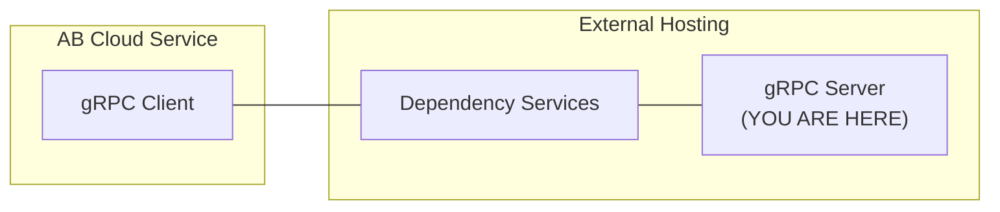

# matchmaking-function-grpc-plugin-server-java

This repository contains `gRPC server` sample app (Java) for AccelByte Cloud service `matchmaking function` customization.

The `gRPC server` is a part of AccelByte Cloud service customization gRPC plugin architecture.



> :warning: **If you are new to AccelByte Cloud service customization gRPC plugin architecture**: You may want to read `OVERVIEW.md` in the `grpc-plugin-dependencies` repository to get the overview of the architecture.

## Prerequisites

1. Windows 10 WSL2 or Linux Ubuntu 20.04 with the following tools installed.

    a. bash

    b. make

    c. docker

    d. docker-compose v2

    e. jdk 17

2. AccelByte Cloud demo environment.

    a. Base URL: https://demo.accelbyte.io.

    b. [Create a Game Namespace](https://docs.accelbyte.io/esg/uam/namespaces.html#tutorials) if you don't have one yet. Keep the `Namespace ID`.

    c. [Create an OAuth Client](https://docs.accelbyte.io/guides/access/iam-client.html) with confidential client type with the following permission. Keep the `Client ID` and `Client Secret`.

       - NAMESPACE:{namespace}:MMV2GRPCSERVICE - READ

## Setup

Create a docker compose `.env` file based on `.env.template` file and fill in the required environment variables in `.env` file.

```
AB_BASE_URL=https://demo.accelbyte.io      # Base URL
AB_CLIENT_ID=xxxxxxxxxx                    # Client ID
AB_CLIENT_SECRET=xxxxxxxxxx                # Client Secret
AB_NAMESPACE=xxxxxxxxxx                    # Namespace ID
PLUGIN_GRPC_SERVER_AUTH_ENABLED=false      # Enable or disable access token and permission check
```

> :exclamation: **For the server and client**: Use the same Base URL, Client ID, Client Secret, and Namespace ID.

## Building

To build the application, use the following command.

```
make build
```

To build and create a docker image of the application, use the following command.

```
make image
```

For more details about the command, see [Makefile](Makefile).

## Running

To run the docker image of the application which has been created beforehand, use the following command.

```
docker-compose up
```

OR

To build, create a docker image, and run the application in one go, use the following command.

```
docker-compose up --build
```

## Testing

### Test Functionality in Local Development Environment

The functionality of `gRPC server` methods can be tested in local development environment.

1. Make sure `dependency services` are running. Please read `README.md` in the `grpc-plugin-dependencies` repository on how to run it.

2. Make sure this sample `gRPC server` is also up and running.

3. Run the corresponding `gRPC client` as a stand in for the actual `gRPC client` in AccelByte Cloud, for example `matchmaking-function-grpc-plugin-client-go`.

   a. Clone `matchmaking-function-grpc-plugin-client-go` repository. 

   b. Follow the `README.md` inside to setup, build, and run it.

   c. Try it out! See the instruction in `README.md`.

> :exclamation: **Sample `gRPC server` and `gRPC client` does not have to be implemented in the same programming language**: As long as the gRPC proto is compatible, they should be able to communicate with each other.

### Test Integration with AccelByte Cloud

After testing functionality in local development environment, to allow the actual `gRPC client` in AccelByte Cloud demo environment to access `gRPC server` in local development environment without requiring a public IP address, we can use [ngrok](https://ngrok.com/).

1. Make sure `dependency services` and this sample `gRPC server` are up and running.

2. Sign-in/sign-up to [ngrok](https://ngrok.com/) and get your auth token in `ngrok` dashboard.

3. In `grpc-plugin-dependencies` repository, run the following command to expose `gRPC server` Envoy proxy port in local development environment to the internet. Take a note of the `ngrok` forwarding URL e.g. `tcp://0.tcp.ap.ngrok.io:xxxxx`.

   ```
   make ngrok NGROK_AUTHTOKEN=xxxxxxxxxxx
   ```

4. [Create an OAuth Client](https://docs.accelbyte.io/guides/access/iam-client.html) with confidential client type with the following permissions. Keep the `Client ID` and `Client Secret` for running the [demo.sh](demo.sh) script after this.

   - NAMESPACE:{namespace}:MATCHMAKING:RULES - CREATE, READ, UPDATE, DELETE
   - NAMESPACE:{namespace}:MATCHMAKING:FUNCTIONS - CREATE, READ, UPDATE, DELETE
   - NAMESPACE:{namespace}:MATCHMAKING:POOL - CREATE, READ, UPDATE, DELETE
   - NAMESPACE:{namespace}:MATCHMAKING:TICKET - CREATE, READ, UPDATE, DELETE
   - ADMIN:NAMESPACE:{namespace}:INFORMATION:USER:* - CREATE, READ, UPDATE, DELETE
   - ADMIN:NAMESPACE:{namespace}:SESSION:CONFIGURATION:* - CREATE, READ, UDPATE, DELETE
   
5. Run the [demo.sh](demo.sh) script to simulate the matchmaking flow which calls this sample `gRPC server` using the `Client ID` and `Client Secret` created in the previous step. Pay attention to sample `gRPC server` log when matchmaking flow is running. `gRPC Server` methods should get called when creating match tickets and it should group players in twos.

   ```
   export AB_BASE_URL='https://demo.accelbyte.io'
   export AB_CLIENT_ID='xxxxxxxxxx'
   export AB_CLIENT_SECRET='xxxxxxxxxx'
   export AB_NAMESPACE='accelbyte'
   export NGROK_URL='tcp://0.tcp.ap.ngrok.io:xxxxx'
   bash demo.sh
   ```
 
> :warning: **Ngrok free plan has some limitations**: You may want to use paid plan if the traffic is high.

### Deploy to AccelByte Gaming Services

After passing integration test against locally running sample app you may want to deploy the sample app to AGS (AccelByte Gaming Services).

1. Download and setup [extend-helper-cli](https://github.com/AccelByte/extend-helper-cli/)
2. Create new Extend App on Admin Portal, please refer to docs [here](https://docs-preview.accelbyte.io/gaming-services/services/customization/using-custom-matchmaking/)
3. Do docker login using `extend-helper-cli`, please refer to its documentation
4. Build and push sample app docker image to AccelByte ECR using the following command inside sample app directory
   ```
   make imagex_push REPO_URL=xxxxxxxxxx.dkr.ecr.us-west-2.amazonaws.com/accelbyte/justice/development/extend/xxxxxxxxxx/xxxxxxxxxx IMAGE_TAG=v0.0.1
   ```
   > Note: the REPO_URL is obtained from step 2 in the app detail on the 'Repository Url' field

Please refer to [getting started docs](https://docs-preview.accelbyte.io/gaming-services/services/customization/using-custom-matchmaking/) for more detailed steps on how to deploy sample app to AccelByte Gaming Service.

## Advanced

### Building Multi-Arch Docker Image

To create a multi-arch docker image of the project, use the following command.

```
make imagex
```

For more details about the command, see [Makefile](Makefile).
