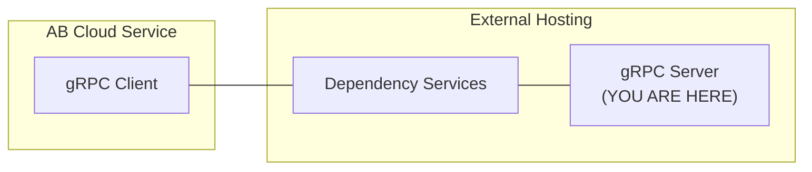

# matchmaking-function-grpc-plugin-server-java

This repository contains `gRPC server` sample app (Java) for AccelByte Cloud service `matchmaking function` customization.

The `gRPC server` is a part of AccelByte Cloud service customization gRPC plugin architecture.



> :warning: **If you are new to AccelByte Cloud service customization gRPC plugin architecture**: You may want to read `OVERVIEW.md` in the `grpc-plugin-dependencies` repository to get the overview of the architecture.

## Prerequisites

1. Windows 10 WSL2 or Linux Ubuntu 20.04 with the following tools installed.

    a. bash

    b. make

    c. docker

    d. docker-compose v2

    e. jdk 17

2. AccelByte Cloud demo environment.

    a. Base URL: https://demo.accelbyte.io.

    b. [Create a Game Namespace](https://docs.accelbyte.io/esg/uam/namespaces.html#tutorials) if you don't have one yet. Keep the `Namespace ID`.

    c. [Create an OAuth Client](https://docs.accelbyte.io/guides/access/iam-client.html) with confidential client type with the following permission. Keep the `Client ID` and `Client Secret`.

       - NAMESPACE:{namespace}:MMV2GRPCSERVICE - READ

## Setup

Create a docker compose `.env` file based on `.env.template` file and fill in the required environment variables in `.env` file.

```
AB_BASE_URL=https://demo.accelbyte.io      # Base URL
AB_CLIENT_ID=xxxxxxxxxx                    # Client ID
AB_CLIENT_SECRET=xxxxxxxxxx                # Client Secret
AB_NAMESPACE=xxxxxxxxxx                    # Namespace ID
PLUGIN_GRPC_SERVER_AUTH_ENABLED=false      # Enable/disable permission authorization
```

> :exclamation: **For the server and client**: Use the same Base URL, Client ID, Client Secret, and Namespace ID.

## Building

To build the application, use the following command.

```
make build
```

To build and create a docker image of the application, use the following command.

```
make image
```

For more details about the command, see [Makefile](Makefile).

## Running

To run the docker image of the application which has been created beforehand, use the following command.

```
docker-compose up
```

OR

To build, create a docker image, and run the application in one go, use the following command.

```
docker-compose up --build
```

## Advanced

### Building Multi-Arch Docker Image

To create a multi-arch docker image of the project, use the following command.

```
make imagex
```

For more details about the command, see [Makefile](Makefile).
